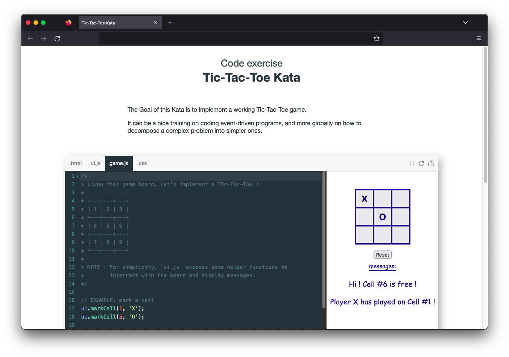

# Tic-Tac-Toe Kata - JavaScript

A code Kata to implement a working Tic-Tac-Toe game.

It can be a nice training on coding event-driven programs,
and more globally on how to decompose a complex problem into simpler ones.

It can be done in JavaScript with an embeded live editor,  
**just code online : <https://jimetevenard.github.io/Tic-Tac-Toe-Kata/>** 🚀

*To focus on algorithmic logic, the HTML + CSS integration of the board is already done.*

.

The live editor is powered by [Flems](https://github.com/porsager/flems), a nice, responsive, embeddable and customizable *JsFiddle-like* editor.